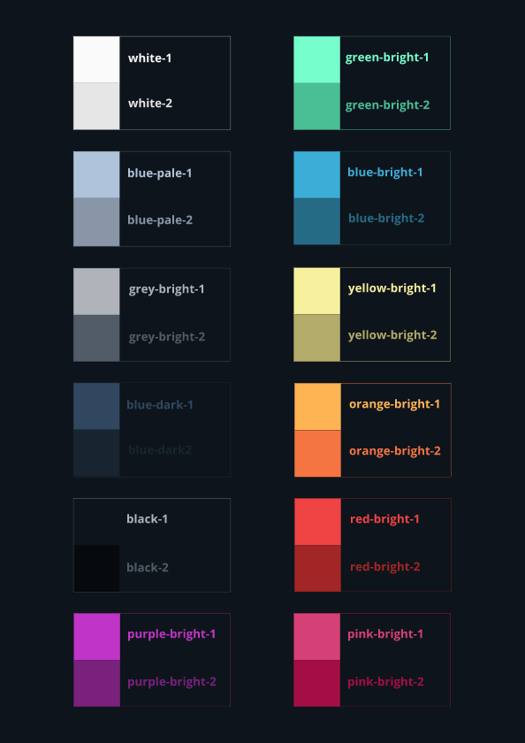

# Glacier

[Glacier](http://glaciertheme.com) is a flat, colorful theme/scheme combo for Sublime Text. It focuses on using saturated colors to introduce more contrast and visual interest compared to other flat approaches.


(font shown in screenshots is [Fira Code](https://github.com/tonsky/FiraCode))



## Install

### Via Package Control

Theme is listed as `Theme - Glacier` in Will Bond's [Sublime Package Control](https://sublime.wbond.net).

### Manual

1. [Download the .zip](https://github.com/joeyfigaro/glacier-theme/archive/master.zip)
2. Unzip and rename the folder to `Theme - Glacier`
3. Copy the folder into `Packages` directory, which you can find using the menu item `Preferences -> Browse Packages...` in Sublime Text

## Setup

Activate the UI theme and color scheme by modifying your user preferences file, which you can find using the menu item `Preferences -> Settings - User` in Sublime Text or <kbd>cmd</kbd><kbd>,</kbd> on a Mac.

To change the color of the text input background, open `Glacier.sublime-theme`, search for "widget" and follow the comments.

### Example settings
```
{
  "theme": "Glacier.sublime-theme",
  "color_scheme": "Packages/Theme - Glacier/glacier.tmTheme",
  "font_face": "Ubuntu Mono"
}
```

### Color Scheme

The color scheme has been tested against many languages:

#### HTML


#### CSS


## Other Editors

Glacier has been ported to:

- Atom \[[UI Theme](https://github.com/mattgraham/glacier-ui-atom), [Syntax Theme](https://github.com/mattgraham/glacier-syntax-atom)\] (thanks to [Matt Graham](https://github.com/mattgraham))
- [Vim, Xcode, PuTTY, Terminal.app, IntelliJ, Terminator](https://github.com/NSBrianWard/Glacier-Remixes) (thanks to [Brian Ward](https://github.com/NSBrianWard))
- [Visual Studio Code](https://github.com/Tyriar/vscode-theme-glacier) (thanks to [Daniel Imms](https://github.com/Tyriar))

## Credits

Most icons are from the fantastic [Spacegray](https://github.com/kkga/spacegray) by [Gadzhi Kharkharov](https://github.com/kkga/) - the folder icon seen in the sidebar is from the talented [Joe Harrison](http://thenounproject.com/joe_harrison/) via [the noun project](http://thenounproject.com/).

## Future Updates

This is my first time writing a theme/color scheme for Sublime, so I have much to learn. As I learn more about styling bits and pieces of the UI, I will make improvements. Please feel free to open issues as you see fit, fork and improve, or contact/follow me on [Twitter](http://twitter.com/joeyfigaro).
